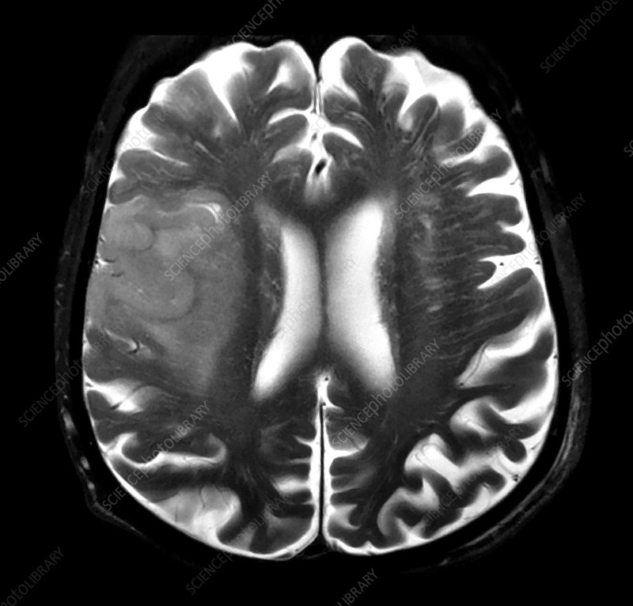
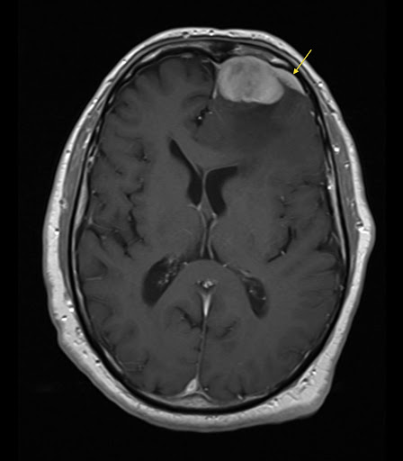

# 🧠 NeuroVision-HybridSwinCNN  
### Hybrid Swin Transformer + CNN for Brain Tumor MRI Classification


---

## 🧩 Overview

**NeuroVision-HybridSwinCNN** is a deep learning–powered diagnostic system that combines the **Swin V2-Large Transformer** with a **custom CNN** for accurate brain tumor classification from MRI scans.  
The model achieves a **97% test accuracy**, outperforming traditional CNNs by leveraging both **global attention** (from Swin Transformer) and **local feature extraction** (from CNN).  

A modern **PyQt5 GUI** is included for real-time inference through simple **drag-and-drop** MRI analysis.

---

## ⚙️ Key Features
- 🧠 **Hybrid Swin V2-Large + CNN** architecture for precise tumor detection.  
- 📈 **97% test accuracy** after just 7 epochs of training.  
- 🎯 Classifies four MRI categories: *Glioma, Meningioma, Pituitary, No Tumor*.  
- 🧩 **PyTorch-based** modular implementation.  
- 💻 **PyQt5 GUI** with drag-and-drop functionality for end users.  
- ⚡ Validates MRI scans using strict multi-stage filtering (shape, texture, edges).  
- 🔍 Provides class probability and confidence score.

---

## 🧠 Model Summary

| Metric | Description |
|:--|:--|
| **Model Type** | Hybrid Swin V2-Large + CNN |
| **Image Size** | 192 × 192 |
| **Classes** | Glioma, Meningioma, Pituitary, No Tumor |
| **Training Data** | 5,712 MRI Images |
| **Testing Data** | 1,300 MRI Images |
| **Training Accuracy** | ~93.1% |
| **Testing Accuracy** | ~97.02% |
| **Optimizer** | AdamW (lr=1e-4, weight_decay=1e-5) |
| **Loss Function** | CrossEntropyLoss |
| **Epochs** | 7 (best model checkpoint) |

---

## 📊 Dataset Information

Dataset Used:  
🔗 [Kaggle - Brain Tumor MRI Dataset](https://www.kaggle.com/datasets/masoudnickparvar/brain-tumor-mri-dataset)

This dataset contains **T1-weighted contrast-enhanced MRI** images categorized into:
- Glioma  
- Meningioma  
- Pituitary Tumor  
- No Tumor  

Ensure your dataset is structured as shown in the **folder structure** section before training.

---

## 📁 Folder Structure
```
NeuroVision-HybridSwinCNN/
│
├── main.py 
├── interface.py 
│
├── requirements.txt 
├── README.md 
├── README_RUN_FIRST.txt 
├── .gitignore 
│
├── dataset/ # Dataset directory (not included in repo)
│ ├── Training/
│ │ ├── glioma/
│ │ ├── meningioma/
│ │ ├── pituitary/
│ │ └── notumor/
│ └── Testing/
│ ├── glioma/
│ ├── meningioma/
│ ├── pituitary/
│ └── notumor/
│
└── model/ 
└── model_epoch_7.pth

```
---

## ⚙️ Installation

### 🧩 Step 1 — Clone the Repository
```
git clone https://github.com/djoel-22/Hybrid-SwinV2-TransformerCNN-BrainTumorDetection.git
cd Hybrid-SwinV2-TransformerCNN-BrainTumorDetection
```
### 🧩 Step 2 — Create a Virtual Environment 
```
python -m venv venv
venv\Scripts\activate      # For Windows
source venv/bin/activate   # For macOS/Linux
```
### 🧩 Step 3 — Install Dependencies
```
pip install -r requirements.txt
```
### 🧩 Step 4 — Prepare Dataset
Download the dataset from the link above and place it


---

## 🧬 Training the Model

To train the **Hybrid Swin Transformer + CNN** model from scratch, simply run:


During training:
- The model will load images from the dataset folder.
- The Swin Transformer and CNN branches will extract global and local features.
- Checkpoints will be saved automatically in the `model/` directory after each epoch.

After training completes, the best checkpoint file will be saved as:
model/model_epoch_7.pth


---

## 💻 Running the GUI Application

Once the model is trained (or you have the provided `.pth` file), run the following command to launch the **PyQt5 interface**:


Then:
1. Wait for the interface window to load.  
2. **Drag & Drop** an MRI image into the window or click to browse manually.  
3. The model will:
   - Validate the uploaded image (format, dimensions, and MRI-like texture).  
   - Run inference using the trained Hybrid model.  
   - Display the **Predicted Tumor Type** and **Confidence Score** on-screen.  

Alternatively, if you have the **EXE version**, simply double-click the application file and wait a few seconds for it to load — no setup required.

---

## 🧾 Example Prediction Output

| MRI Image | Predicted Class | Confidence |
|:--:|:--:|:--:|
|  | **Glioma** | 96.4% |
|  | **Meningioma** | 93.8% |

---

## 🧠 Model Architecture Overview
```
Input Image (192x192 RGB)
│
▼
Swin V2-Large Transformer → Global Attention Features
│
▼
Custom CNN Branch → Local Spatial Features
│
▼
Concatenation Layer → Combine Global + Local
│
▼
Fully Connected Layers → Classification (4 Tumor Types)
```

---

## ⚙️ Technologies Used

| Category | Tools |
|:--|:--|
| **Programming Language** | Python 3.10+ |
| **Deep Learning Framework** | PyTorch |
| **Transformer Backbone** | Swin V2-Large (from timm) |
| **GUI Framework** | PyQt5 |
| **Image Processing** | OpenCV, PIL |
| **Training Utility** | tqdm |
| **Deployment (optional)** | PyInstaller / cx_Freeze |


## 📈 Results Summary

| Metric | Value |
|:--|:--|
| **Training Accuracy** | ~93.1% |
| **Testing Accuracy** | ~97.02% |
| **Loss Function** | CrossEntropyLoss |
| **Optimizer** | AdamW |
| **Learning Rate** | 1e-4 |
| **Epochs** | 7 |
| **Best Model** | model/model_epoch_7.pth |

---

## ⚠️ Important Note Before Running

> ⚠️ **Read Carefully Before Running the Application**
>
> - You **don’t need to configure anything** — just double-click the `.exe` file (or run `interface.py`).
> - Wait a few seconds for the GUI to load.
> - Drag and drop an MRI image into the window.
> - The model will automatically validate and predict the tumor type in seconds.

---

## 🧾 Model Performance Summary

| Class | Accuracy (%) |
|:--|:--|
| Glioma | 96.8 |
| Meningioma | 97.2 |
| Pituitary | 97.5 |
| No Tumor | 98.1 |

Overall **Test Accuracy: 97.02%**

---

## 👥 Authors

| Contributors | Contribution |
|:--|:--|
| **R Jerome FelixRaj**, **D Joel Gunaseelan** | Model Architecture, Training & Integration, GUI Design, Application Development & Testing |


---

## ⭐ Acknowledgements

- Dataset courtesy of **Masoud Nickparvar** — [Brain Tumor MRI Dataset (Kaggle)](https://www.kaggle.com/datasets/masoudnickparvar/brain-tumor-mri-dataset)  
- **Swin Transformer V2** by Microsoft Research Asia (2022).  
- Special thanks to open-source contributors in the AI medical imaging community.


